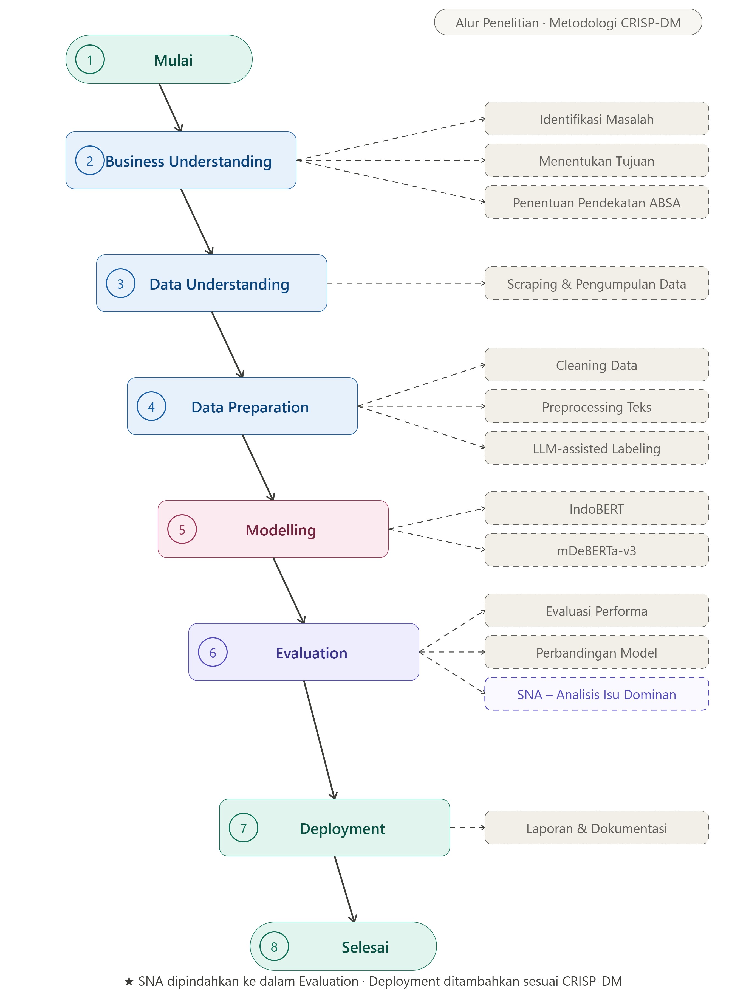

# Comparison of IndoBERT and mDeBERTa-v3 for Aspect-Based Sentiment Analysis on Gojek Application Reviews with LLM-Assisted Labeling and Semantic Network Analysis

**Big Data Laboratory — Information Systems, Universitas Multimedia Nusantara**

> Undergraduate Thesis (Skripsi) Project — Program Studi Sistem Informasi

## 👤 Authors

| Role | Name | ID |
|---|---|---|
| Student | Nathanael Silaban | 00000078430 |
| Supervisor | Dr. Erick Fernando | — |

📄 **Paper:** *Comparison of IndoBERT and mDeBERTa-v3 for Aspect-Based Sentiment Analysis on Gojek Application Reviews with LLM-Assisted Labeling and Semantic Network Analysis* (submitted).

---

## 📌 Overview

User reviews of the Gojek application on the Google Play Store frequently express opinions toward **several service aspects within a single text**, so document-level sentiment analysis is insufficient to explain the user experience in detail. This project performs **Aspect-Based Sentiment Analysis (ABSA)** on Gojek reviews by comparing a monolingual Indonesian transformer (**IndoBERT**) with a multilingual transformer (**mDeBERTa-v3**), supported by **LLM-assisted labeling** using Qwen2.5-0.5B-Instruct and **Semantic Network Analysis (SNA)**, then deploys the best model in an interactive **Streamlit dashboard**.

**Six service aspects:** Application · Service · Driver · Price & Tariff · GoPay & Payment · Promotion & Advertisement
**Three sentiment classes:** positive · negative · neutral

## 🧭 Research Framework (Alur Penelitian)

The research follows the **CRISP-DM** framework:



`Data Collection → Data Preparation → LLM-Assisted Labeling → Aspect-Level Dataset Construction → Modeling (IndoBERT vs mDeBERTa-v3) → Evaluation → SNA → Deployment`

## 📊 Dataset

| Stage | Count |
|---|---|
| Raw reviews (Google Play Store, `com.gojek.app`) | 50,000 |
| After cleaning & preprocessing | 37,790 |
| Aspect-level instances (review, aspect, sentiment) | **51,098** |
| Train / Test (grouped 80:20 split, leakage-free) | 40,886 / 10,212 |

Labels were generated with **Qwen2.5-0.5B-Instruct** (local, offline) and validated by stratified human checking of 300 samples: **aspect accuracy 90%**, sentiment accuracy 61.33%, full-pair accuracy 54.67% — confirming LLM labels must be treated as assisted drafts, not ground truth.

## 🏆 Key Results

| Metric | IndoBERT | mDeBERTa-v3 |
|---|---|---|
| Accuracy | **0.9677** | 0.8941 |
| Macro F1-score | **0.9656** | 0.8886 |
| Weighted F1-score | **0.9678** | 0.8955 |
| Train–test macro F1 gap | 0.0268 | 0.0110 |
| Parameters | 124,443,651 | 278,811,651 (2.24×) |

- **The smaller, language-specific model wins**: IndoBERT outperforms mDeBERTa-v3 by ~7.7 macro-F1 points despite having 2.24× fewer parameters.
- Both models **generalize well** (train–test gap < 0.05).
- Epoch selection justified by an explicit **1–10 epoch-variation experiment** (validation loss minimum 0.2607 at epoch 4).
- **SNA** (35 nodes, 461 edges): the word *driver* dominates opinion, co-occurring with *lama* (long), *nunggu* (waiting), *susah* (difficult), and *cancel* — pinpointing waiting time and order cancellation as key operational issues.
- **Deployment**: Streamlit dashboard passed **13/13 black-box test scenarios**.

## 📁 Repository Structure

```
├── README.md
├── requirements.txt
├── images/
│   ├── research_framework.png      # alur penelitian (CRISP-DM)
│   ├── confusion_matrix_indobert.png
│   ├── confusion_matrix_mdeberta.png
│   └── sna_network.png
├── notebooks/
│   ├── 01_scraping_eda_cleaning.ipynb        # data collection, EDA, cleaning, data-loss analysis
│   └── 02_labeling_modeling_evaluation.ipynb # LLM labeling, fine-tuning, evaluation, epoch sweep, SNA
├── deployment/
│   └── app.py                      # Streamlit dashboard
├── docs/
│   ├── Skripsi_Nathanael_Silaban_00000078430.pdf
│   └── Paper_Springer_Format.pdf
└── data/
    └── README.md                   # dataset access note (link / instructions)
```

## ⚙️ Requirements & Installation

```bash
git clone https://github.com/Big-Data-Laboratory-UMN/NathanaelSilaban_00000078430_ABSA-Gojek-IndoBERT-vs-mDeBERTa.git
cd NathanaelSilaban_00000078430_ABSA-Gojek-IndoBERT-vs-mDeBERTa
pip install -r requirements.txt
```

Main stack: `PyTorch`, `Hugging Face Transformers`, `google-play-scraper`, `scikit-learn`, `pandas`, `NetworkX`, `Streamlit`.

## 🚀 How to Run

**1. Reproduce the pipeline** — run the notebooks in order (`notebooks/01_...` → `notebooks/02_...`). Fine-tuning configuration: AdamW, lr `2e-5`, batch 16, max length 128, class-weighted cross-entropy, epochs 4 (IndoBERT) / 3 (mDeBERTa-v3).

**2. Launch the dashboard**

```bash
streamlit run deployment/app.py
```

The dashboard retrieves reviews by app ID, runs ABSA inference with the best IndoBERT model, shows per-aspect sentiment summaries and SNA, and exports results to CSV.

## 🔬 Future Research Directions

- Extend human-validation coverage of LLM-generated labels
- Larger / instruction-tuned Indonesian models as annotators and classifiers
- Aspect-term extraction alongside aspect-category classification
- Integration with live operational data streams

## 📖 Citation

```
Silaban, N., & Fernando, E. (2025). Comparison of IndoBERT and mDeBERTa-v3 for
Aspect-Based Sentiment Analysis on Gojek Application Reviews with LLM-Assisted
Labeling and Semantic Network Analysis. Undergraduate Thesis, Information Systems,
Universitas Multimedia Nusantara.
```

## 📄 License

For academic and research purposes — Big Data Laboratory, Universitas Multimedia Nusantara.
